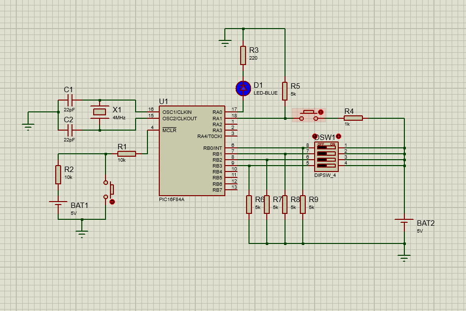

# password-pic16f84a

# Sistema de contraseña con PIC16F84A o similares

[(Read in English)](#password-system-with-pic16f84a-or-similar)

Este es un sistema de seguridad por medio de contraseña haciendo uso del microcontrolador de *Microchip Technology Inc*, el PIC16F84A. El chip envía una señal lógica ALTA por su pin de salida RA0 (Pin 17) durante cinco segundos cuando una contraseña correcta es ingresada, señal que puede ser acoplada a otro sistema mecánico o eléctrico.

Cada palabra de la contraseña es ingresada haciendo uso del *PORTB* del microcontrolador (Los pines 6:13 o RB0:RB7 en el diagrama). En el ejemplo, cada palabra está compuesta por un *nibble* (Cuatro bits), por lo que tiene 2⁴ (16) estados posibles, aunque puede hacerse uso del byte completo sin cambiar el código, realizando las conexiones pertinentes en los pines restantes, para tener 2⁸ (256) estados. En el código se incluyen por defecto cuatro palabras para la contraseña, lo que es decir en el ejemplo, (2⁴)⁴ (65,536) contraseñas distintas, permitiendo hasta 4,294,967,296 contraseñas distintas usando el PORTB completo sin necesidad de aumentar el número de palabras, y una cantidad mucho más alta si aumenta el número de palabras por contraseña (Lo cual requiere una modificación del código).

Al encender el microcontrolador, este se encuentra inicialmente en estado desbloqueado. En este estado es posible que el usuario agregue una contraseña. Para hacerlo, hay que modificar el estado del switch de entrada (SW1 en el diagrama esquemático), y posteriormente presionar el botón de 'cargar palabra' (SW2). Una vez cargadas las cuatro palabras, el microcontrolador cierra su salida. Para desbloquear nuevamente sistema, hay que ingresar la contraseña de manera análoga, ingresando una palabra en el switch de entrada, y cargandola con el botón de cargar palabra. El sistema no muestra ninguna retroalimentación sobre las palabras ingresadas, por lo que es imposible saber si una palabra pertenece a una contraseña sin conocer esta.

El proyecto se encuentra listo para modificar y compilar. El compilador de este ensamblador es *mpasm*, el cual puede usarse de manera independiente, o encontrarse en el software *MPLAB* de *Microchip*. Convenientemente, el repositorio está ya organizado para ser cargado directamente a MPLAB, sólo es necesario clonar el repositorio o descargarlo en ZIP, y abrirlo con MPLAB (El IDE ignorará automáticamente el diagrama y este archivo).

[Aquí se muestra un diagrama esquemático que muestra el ejemplo de circuito de aplicación con el microcontrolador:](#esquema/schematic)

---

# Password system with PIC16F84A or similar

[(Leer en Español)](#sistema-de-contraseña-con-pic16f84a-o-similares)

This is a security system through a password using the *Microchip Technology Inc*'s microcontroller, the PIC16F84A. The chip will send a logic HIGH by its output pin RA0 (Pin 17) for five seconds when a correct password is entered, the signal can be coupled to other mechanical or electrical system.

Every word of the password is entered making use of the *PORTB* of the microcontroller (Pins 6:13 or RB0:RB7 in the schematic). In the example, every word is made out of a *nibble* (Four bits), so it has 2⁴ (16) possible states, but the whole byte of the port could be used without changing the code, just by making the relevant connections in the remaining pins, giving 2⁸ states per word. The code has by default four words per password, so, in our example, (2⁴)⁴ (65,536) different passwords could be created, allowing up to 4,294,967,296 by using the whole PORTB without changing the code, and even more by raising the number of words per password (Which needs to be changed in the code).

When the microcontroller is started, it is initially unlocked. In this state it is possible to add a password. To do it, the input switch (SW1 on the schematic) must be changed, and then the word must be submitted by pushing the 'upload word' buttong (SW2). Once the four words are submitted, the microcontroller locks its output. To unlock the output again, the password must be entered the same way, by entering a word on the input switch, and submitting it with the upload switch. The system gives no feedback whatsoever about the password when its blocked, so it's harder to brute force it, and it's impossible to know if a word is part of the password.

The project is ready to modify and compile. The compiler of this assembly is *mpasm*, which can be used independently, or can be found in the software *MPLAB* of *Microchip*. Conveniently, this repository is already organized to be loaded to MPLAB, it's just necessary to clone the repo or download it as ZIP, and loading it with MPLAB (The IDE will ignore this file and the schematic).

[You can find a schematic with an example circuit application using the microcontroller here:](#esquema/schematic)

---

# Esquema/Schematic

