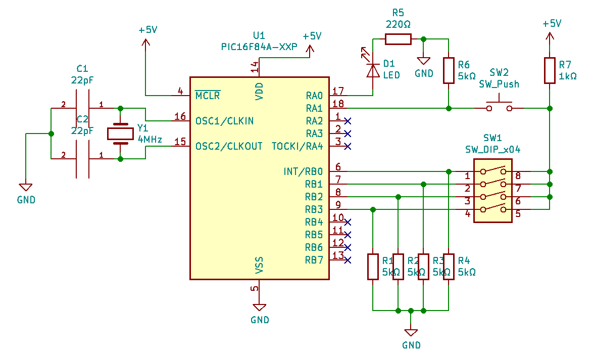

# password-pic16f84a
**Sistema de contraseña con PIC16F84A o similares**

Este es un sistema de seguridad por medio de contraseña haciendo uso del microcontrolador de *Microchip Technology Inc*, el PIC16F84A. El chip envía una señal lógica ALTA durante cinco segundos cuando una contraseña correcta es ingresada, la cual puede ser acoplada a otro sistema mecánico o eléctrico.

Cada palabra de la contraseña está compuesta por un *nibble* (Cuatro bits), por lo que tiene 2⁴ (16) estados posibles. En el código se incluyen por defecto cuatro palabras para la contraseña, lo que es decir, (2⁴)⁴ (65,536) contraseñas distintas, sin embargo, el código puede adaptarse fácilmente para que cada palabra use un byte (8 bits), permitiendo hasta 4,294,967,296 contraseñas distintas sin necesidad de aumentar el número de palabras, y una cantidad mucho más alta si aumenta el número de palabras por contraseña.

Al encender el microcontrolador, este se encuentra inicialmente en estado desbloqueado. En este estado es posible que el usuario agregue una contraseña. Para hacerlo, hay que modificar el estado del switch de entrada (SW2 en el diagrama esquemático), y posteriormente presionar el botón de 'cargar palabra' (SW3). Una vez cargadas las cuatro palabras, el microcontrolador cierra su salida. Para desbloquear nuevamente sistema, hay que ingresar la contraseña de manera análoga, ingresando una palabra en el switch de entrada, y cargandola con el botón de cargar palabra. El sistema no muestra ninguna retroalimentación sobre las palabras ingresadas, por lo que es imposible saber si una palabra pertenece a una contraseña sin conocer esta.

El proyecto se encuentra listo para modificar y compilar. El compilador de este ensamblador es *mpasm*, el cual puede usarse de manera independiente, o encontrarse en el software *MPLAB* de *Microchip*. Convenientemente, el repositorio está ya organizado para ser cargado directamente a MPLAB, sólo es necesario clonar el repositorio o descargarlo en ZIP, y abrirlo con MPLAB (El IDE ignorará automáticamente el diagrama y este archivo).

A continuación se muestra un diagrama esquemático que muestra un posible circuito de aplicación con el microcontrolador:

